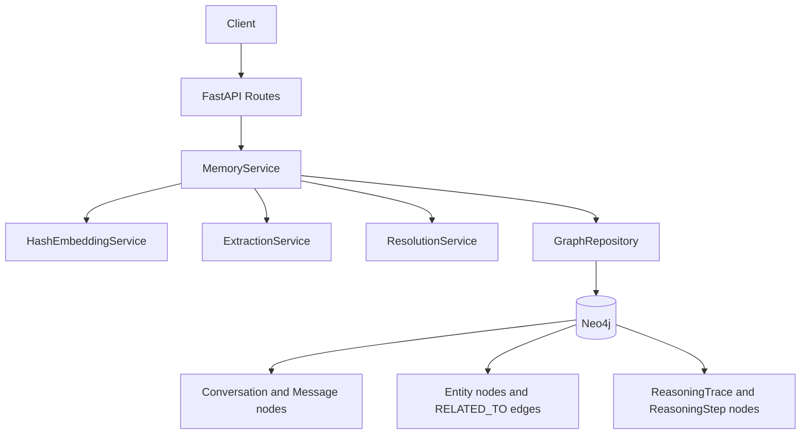
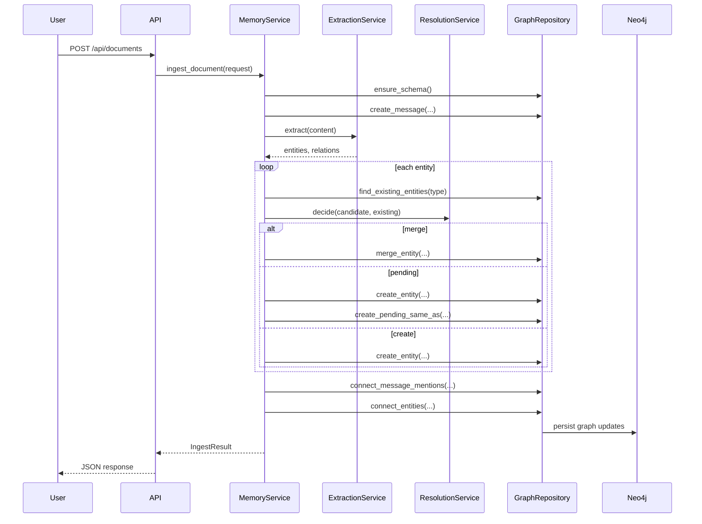
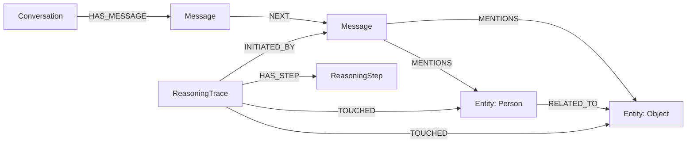

# Vector Index Graph Memory

This project is a graph-native memory prototype that addresses one of the main weaknesses of a flat vector index: semantic similarity is useful for recall, but it is not a reliable definition of identity. The codebase combines FastAPI, Neo4j 5 vector indexes, a deterministic local embedding service, lightweight entity extraction, and a conservative resolution gate so that memory retrieval stays useful without collapsing unrelated entities into the same record.

The README is intentionally detailed because this repository is easier to evaluate when the design tradeoffs are explicit. If you are comparing this prototype with a vector database, a relational schema, or a heavier knowledge graph stack, the sections below explain what each layer does, why it exists, and what compromises were chosen in this implementation.

> [!IMPORTANT]
> This is a prototype focused on memory architecture, not a production-ready agent platform. The extraction pipeline is intentionally lightweight, the embedding model is deterministic and local, and the graph writes are designed to demonstrate identity-preserving memory behavior with minimal external dependencies.

## Table of Contents

This section is important because the README is deliberately long and is meant to support multiple audiences: someone trying to run the service quickly, someone evaluating the architecture, and someone comparing the design against adjacent approaches.

1. [Why This Project Exists](#why-this-project-exists)
2. [What The System Does](#what-the-system-does)
3. [Why A Graph Was Chosen](#why-a-graph-was-chosen)
4. [Tech Stack And Why It Was Chosen](#tech-stack-and-why-it-was-chosen)
5. [Architecture Overview](#architecture-overview)
6. [Memory Tiers](#memory-tiers)
7. [Identity Resolution Strategy](#identity-resolution-strategy)
8. [Retrieval Strategy](#retrieval-strategy)
9. [Repository Structure](#repository-structure)
10. [Quick Start](#quick-start)
11. [Configuration](#configuration)
12. [API Surface](#api-surface)
13. [Example Workflows](#example-workflows)
14. [Testing And Validation](#testing-and-validation)
15. [Current Constraints And Tradeoffs](#current-constraints-and-tradeoffs)

## Why This Project Exists

This section matters because the project only makes sense if the underlying problem is clear. A flat vector index is excellent for fuzzy retrieval, but it tends to blur identity boundaries. If two mentions are semantically close, a naive system may treat them as the same thing even when they should remain distinct. That becomes a memory bug, not just a retrieval bug.

In this repository, identity lives in the graph and similarity remains a signal. That distinction is the central design choice. It makes the system more conservative than a pure semantic search stack, but it also makes it safer for agent memory, where stable references matter over time.

| # | Decision Area | Chosen Approach | Typical Alternative | Why The Choice Helps Here |
| --- | --- | --- | --- | --- |
| <sub>1</sub> | <sub>Primary memory store</sub> | <sub>Neo4j graph with vector indexes</sub> | <sub>Standalone vector database</sub> | <sub>Keeps identity, relationships, and embeddings on the same node set.</sub> |
| <sub>2</sub> | <sub>Entity identity</sub> | <sub>Explicit node identity with merge gate</sub> | <sub>Similarity-only matching</sub> | <sub>Reduces accidental collapse of near matches into one memory.</sub> |
| <sub>3</sub> | <sub>Reasoning retention</sub> | <sub>Reasoning traces in the graph</sub> | <sub>Prompt-only transient chain of thought</sub> | <sub>Preserves provenance about how context was assembled.</sub> |
| <sub>4</sub> | <sub>Retrieval model</sub> | <sub>Hybrid graph plus vector retrieval</sub> | <sub>Top-k embedding recall only</sub> | <sub>Combines semantic recall with neighborhood expansion and provenance.</sub> |
| <sub>5</sub> | <sub>Dedup behavior</sub> | <sub>Merge, pending review, or create</sub> | <sub>Always merge when similar enough</sub> | <sub>Adds a safety band for ambiguous cases.</sub> |

The table above explains the problem framing. It shows that the repository is not trying to beat vector search at pure recall quality; it is trying to keep memory usable over time by separating identity management from similarity scoring.

> [!NOTE]
> The conservative deduplication gate is the key architectural difference. It exists because memory systems often fail gradually through incorrect merges, and those errors are harder to recover from than missed links.

## What The System Does

This section is important because it translates the architecture into concrete behavior. A memory system is only useful if you can explain, in operational terms, what happens on ingest, on chat retrieval, and on duplicate review.

At a high level, the service ingests text, extracts candidate entities and relationships, resolves those candidates against existing graph nodes, stores the message in short-term memory, stores entities in long-term memory, and then retrieves context by mixing semantic search with graph traversal. During chat requests, it also records a reasoning trace that points back to the message and touched entities.

| # | Capability | What It Does | Why It Is Needed |
| --- | --- | --- | --- |
| <sub>1</sub> | <sub>Document ingest</sub> | <sub>Stores a message, extracts entities, resolves duplicates, and writes relationships.</sub> | <sub>Turns raw notes into structured graph memory.</sub> |
| <sub>2</sub> | <sub>Chat context retrieval</sub> | <sub>Stores a user message and returns message hits, entity hits, and related reasoning.</sub> | <sub>Lets a downstream assistant retrieve grounded context.</sub> |
| <sub>3</sub> | <sub>Duplicate review</sub> | <sub>Confirms or rejects pending SAME_AS links.</sub> | <sub>Provides a human checkpoint for ambiguous identity cases.</sub> |
| <sub>4</sub> | <sub>Health reporting</sub> | <sub>Checks whether Neo4j is reachable.</sub> | <sub>Separates service availability from storage connectivity.</sub> |
| <sub>5</sub> | <sub>Graph statistics</sub> | <sub>Returns counts for conversations, messages, entities, traces, and pending duplicates.</sub> | <sub>Gives a fast operational snapshot of memory growth.</sub> |

The table above describes the runtime surface of the prototype. It is useful as a mental map before reading the API section because it connects the implementation to the memory lifecycle rather than just listing routes.

## Why A Graph Was Chosen

This section matters because the repository name itself makes a claim: a vector index alone is not enough. That claim should be compared against realistic alternatives instead of being treated as an article of faith.

The graph model was chosen because memory is not only about finding similar chunks of text. Memory also needs stable references, directional relationships, provenance, and the ability to attach multiple signals to the same entity. In this implementation, a single `Entity` node can hold a canonical name, aliases, a typed label, an embedding, a description, and relationship edges. That gives the system one place to reason about identity.

| # | Option | Strengths | Weaknesses | Why It Was Not The Primary Choice |
| --- | --- | --- | --- | --- |
| <sub>1</sub> | <sub>Standalone vector database</sub> | <sub>Fast semantic recall and operational simplicity.</sub> | <sub>Poor native identity modeling and relationship semantics.</sub> | <sub>The project goal is identity-preserving memory, not only nearest-neighbor search.</sub> |
| <sub>2</sub> | <sub>Relational schema</sub> | <sub>Strong constraints, familiar tooling, and transactional safety.</sub> | <sub>Relationship-heavy traversals and heterogeneous entity typing become awkward.</sub> | <sub>The graph shape is the main abstraction, not tabular normalization.</sub> |
| <sub>3</sub> | <sub>In-memory object graph</sub> | <sub>Simple to prototype and fast locally.</sub> | <sub>No durable shared persistence or vector index integration.</sub> | <sub>The repository is meant to persist memory across requests.</sub> |
| <sub>4</sub> | <sub>Neo4j graph with vector indexes</sub> | <sub>Unifies embeddings, identity, edges, and traversal in one store.</sub> | <sub>Adds operational complexity compared with a single-purpose store.</sub> | <sub>This is the best fit for the architecture being demonstrated.</sub> |

The table above is a tradeoff table, not a benchmark claim. Its purpose is to show that the graph choice is motivated by data shape and identity requirements, not by the idea that a graph is universally better than every other persistence layer.

> [!TIP]
> If your only requirement is top-k semantic recall over chunks, a vector store may be simpler. This project becomes more compelling when you need stable entities, typed links, and reversible duplicate decisions.

## Tech Stack And Why It Was Chosen

This section is important because architecture discussions are often too abstract. The actual implementation choices matter: the repository uses a specific Python stack, a specific graph backend, and deliberately avoids external embedding APIs.

| # | Layer | Technology | Why It Was Chosen | Practical Consequence |
| --- | --- | --- | --- | --- |
| <sub>1</sub> | <sub>API layer</sub> | <sub>FastAPI</sub> | <sub>Provides typed request models, automatic OpenAPI docs, and simple dependency wiring.</sub> | <sub>You get interactive docs at `/docs` with minimal boilerplate.</sub> |
| <sub>2</sub> | <sub>Data validation</sub> | <sub>Pydantic</sub> | <sub>Keeps API contracts explicit and easy to inspect.</sub> | <sub>Request and response shapes are self-documenting and testable.</sub> |
| <sub>3</sub> | <sub>Graph store</sub> | <sub>Neo4j 5.x</sub> | <sub>Supports both graph traversal and vector index queries in the same database.</sub> | <sub>The system can mix semantic search with neighborhood expansion.</sub> |
| <sub>4</sub> | <sub>Embedding service</sub> | <sub>Local deterministic hash embedding</sub> | <sub>Removes external API cost and makes tests deterministic.</sub> | <sub>Semantic quality is lower than modern embedding models, but reproducibility is high.</sub> |
| <sub>5</sub> | <sub>Extraction strategy</sub> | <sub>Regex and heuristic extraction</sub> | <sub>Keeps the prototype easy to run and inspect.</sub> | <sub>Coverage is intentionally limited and should be treated as a scaffold.</sub> |
| <sub>6</sub> | <sub>Test stack</sub> | <sub>Pytest plus FastAPI TestClient</sub> | <sub>Supports narrow, deterministic tests without requiring Neo4j.</sub> | <sub>Core behavior can be validated locally before doing full end-to-end runs.</sub> |

The table above explains the chosen stack in practical terms. It is useful because each technology serves the prototype goal differently: FastAPI improves interface clarity, Neo4j supports the data model, and the local embedding service keeps the repository runnable without third-party services.

## Architecture Overview

This section is important because the value of the project comes from how the pieces interact, not from any one component in isolation. The diagram below shows the main control flow from incoming text to graph persistence and context retrieval.



The diagram above explains the ownership boundaries. It shows that `MemoryService` is the orchestration layer, while the repository owns persistence, the embedding service owns vector generation, the extraction service owns candidate generation, and the resolution service owns merge decisions.



The sequence diagram above shows why the architecture is split into services instead of keeping everything in the route layer. It makes it easier to reason about which code decides, which code persists, and which code only transforms data.

## Memory Tiers

This section matters because the repository deliberately separates memory into tiers instead of treating all stored text as the same thing. That separation is what allows message history, stable entity knowledge, and reasoning provenance to coexist without being conflated.

| # | Tier | Main Node Types | Role In The System | Why It Is Separate |
| --- | --- | --- | --- | --- |
| <sub>1</sub> | <sub>Short-term memory</sub> | <sub>`Conversation`, `Message`</sub> | <sub>Stores session-scoped interaction history.</sub> | <sub>Conversation flow is temporal and should stay distinct from long-lived entity identity.</sub> |
| <sub>2</sub> | <sub>Long-term memory</sub> | <sub>`Entity` plus typed labels</sub> | <sub>Stores canonicalized knowledge about people, objects, locations, events, and organizations.</sub> | <sub>Entity identity persists across conversations.</sub> |
| <sub>3</sub> | <sub>Reasoning memory</sub> | <sub>`ReasoningTrace`, `ReasoningStep`</sub> | <sub>Records that a retrieval path was executed and which entities it touched.</sub> | <sub>Provenance and inspection should not be mixed into entity state.</sub> |

The table above explains the conceptual separation of memory. It is useful because it shows that the architecture is not just storing more nodes; it is assigning different responsibilities to different node families.



The graph above illustrates the memory tier boundaries with actual edge names used by the code. Its purpose is to make the storage shape concrete before you look at Cypher behavior or API outputs.

## Identity Resolution Strategy

This section is important because identity management is the central algorithmic choice in the repository. The system is intentionally conservative: similarity helps propose decisions, but it does not automatically define truth unless the confidence is high enough.

For each extracted entity candidate, the service looks up existing entities of the same top-level type, computes exact-match, fuzzy-match, and embedding-based semantic similarity signals, and then chooses one of three actions:

1. merge into an existing canonical node
2. create a new node and mark a pending `SAME_AS` review edge
3. create a new node with no duplicate link

| # | Signal | Source | What It Captures | Why It Matters |
| --- | --- | --- | --- | --- |
| <sub>1</sub> | <sub>Exact match</sub> | <sub>Name and aliases compared case-insensitively</sub> | <sub>Literal identity agreement.</sub> | <sub>Prevents needless duplicate nodes when names already match exactly.</sub> |
| <sub>2</sub> | <sub>Fuzzy match</sub> | <sub>`difflib.SequenceMatcher` ratio</sub> | <sub>Surface-form similarity.</sub> | <sub>Handles spelling variation and minor formatting changes.</sub> |
| <sub>3</sub> | <sub>Semantic match</sub> | <sub>Cosine similarity over deterministic embeddings</sub> | <sub>Contextual resemblance.</sub> | <sub>Provides recall when exact strings differ.</sub> |
| <sub>4</sub> | <sub>Type filter</sub> | <sub>Same `entity_type` only</sub> | <sub>Coarse ontology guardrail.</sub> | <sub>Reduces bad comparisons across incompatible categories.</sub> |

The table above explains the scoring ingredients. Its purpose is to show that the repository does not rely on any single signal; instead, it layers simple signals that are easy to inspect and test.

The implementation uses the following scoring rule for the best non-exact candidate:

$$
score = \max\left(exact,\ 0.45 \cdot fuzzy + 0.55 \cdot semantic\right)
$$

Cosine similarity for two vectors $u$ and $v$ is computed as:

$$
\mathrm{cosine}(u, v) = \sum_{i=1}^{n} u_i v_i
$$

The decision thresholds are:

$$
	ext{merge if } score \ge 0.95
$$

$$
	ext{pending review if } 0.85 \le score < 0.95
$$

$$
	ext{create new if } score < 0.85
$$

These formulas matter because they define the safety posture of the system. The purpose of writing them explicitly is to make the merge policy auditable instead of hiding it inside implementation details.

| # | Score Band | Action | Why This Policy Exists |
| --- | --- | --- | --- |
| <sub>1</sub> | <sub>`score >= 0.95`</sub> | <sub>Automatic merge</sub> | <sub>Only very strong matches are collapsed into one canonical node.</sub> |
| <sub>2</sub> | <sub>`0.85 <= score < 0.95`</sub> | <sub>Create pending `SAME_AS`</sub> | <sub>Ambiguous matches remain reviewable instead of silently merged.</sub> |
| <sub>3</sub> | <sub>`score < 0.85`</sub> | <sub>Create new entity</sub> | <sub>Protects memory from identity drift when evidence is weak.</sub> |

The table above is the operational policy table. It explains how the numeric scores map to graph writes and why the ambiguous middle band exists at all.

> [!IMPORTANT]
> The request model includes a `source` field for document ingest, but the current implementation does not persist that field in the graph yet. It is accepted at the API boundary but is not part of the stored message or entity payloads in this prototype.

## Retrieval Strategy

This section matters because a graph-native memory system still needs strong retrieval behavior. The project does not discard vector search; it embeds it inside a broader retrieval shape that can return semantically similar messages, semantically similar entities, graph neighbors, and prior reasoning traces.

At chat time, the repository stores the current user message, queries the message vector index within the current conversation, queries the entity vector index globally, expands to neighboring entities through `RELATED_TO`, and then looks up prior reasoning traces that touched the returned entities.

| # | Retrieval Step | Where It Runs | What It Returns | Why It Is Useful |
| --- | --- | --- | --- | --- |
| <sub>1</sub> | <sub>Message vector search</sub> | <sub>Neo4j `message_embedding_index`</sub> | <sub>Relevant messages from the same session.</sub> | <sub>Keeps short-term recall tied to the active conversation.</sub> |
| <sub>2</sub> | <sub>Entity vector search</sub> | <sub>Neo4j `entity_embedding_index`</sub> | <sub>Relevant entity nodes with scores.</sub> | <sub>Pulls long-term memory into the response.</sub> |
| <sub>3</sub> | <sub>Neighbor expansion</sub> | <sub>`RELATED_TO` traversal</sub> | <sub>Nearby entities attached to the hit set.</sub> | <sub>Brings structure into the returned context, not only similarity.</sub> |
| <sub>4</sub> | <sub>Reasoning trace lookup</sub> | <sub>`ReasoningTrace` to `Entity` links</sub> | <sub>Prior retrieval queries that touched similar entities.</sub> | <sub>Adds provenance and historical context.</sub> |

The table above describes the retrieval assembly pipeline. Its purpose is to explain why the response includes multiple kinds of context instead of a single ranked list of chunks.

| # | Retrieval Style | Strength | Limitation | Why The Hybrid Design Was Chosen |
| --- | --- | --- | --- | --- |
| <sub>1</sub> | <sub>Keyword-only</sub> | <sub>Simple and transparent.</sub> | <sub>Misses paraphrases and latent similarity.</sub> | <sub>Not enough for semantic memory recall.</sub> |
| <sub>2</sub> | <sub>Vector-only</sub> | <sub>Strong fuzzy recall.</sub> | <sub>No native notion of identity or structured neighborhood.</sub> | <sub>Too weak for multi-hop memory explanation.</sub> |
| <sub>3</sub> | <sub>Graph-only traversal</sub> | <sub>Strong structural explainability.</sub> | <sub>Needs an entry point and struggles with semantic ambiguity.</sub> | <sub>Better as a companion to embedding search.</sub> |
| <sub>4</sub> | <sub>Hybrid graph plus vector</sub> | <sub>Combines semantic entry points with relationship expansion.</sub> | <sub>Operationally more complex.</sub> | <sub>Matches the goals of memory retrieval in this prototype.</sub> |

The table above is a retrieval tradeoff table. It exists to explain why the repository mixes retrieval modes instead of replacing one with another.

## Repository Structure

This section matters because architecture is easier to trust when the code layout mirrors the conceptual boundaries. The repository is small, but each directory maps cleanly to a responsibility area.

| # | Path | Role | Why The Separation Helps |
| --- | --- | --- | --- |
| <sub>1</sub> | <sub>`app/main.py`</sub> | <sub>Application assembly and dependency wiring.</sub> | <sub>Keeps startup concerns separate from route logic.</sub> |
| <sub>2</sub> | <sub>`app/routes/`</sub> | <sub>HTTP route definitions.</sub> | <sub>Makes API behavior easy to inspect and test.</sub> |
| <sub>3</sub> | <sub>`app/services/`</sub> | <sub>Embedding, extraction, memory orchestration, and resolution logic.</sub> | <sub>Encapsulates behavior that should not live in routes or repositories.</sub> |
| <sub>4</sub> | <sub>`app/repositories/`</sub> | <sub>Neo4j schema, writes, and retrieval queries.</sub> | <sub>Localizes Cypher and persistence details.</sub> |
| <sub>5</sub> | <sub>`app/models/`</sub> | <sub>Pydantic schemas and typed payloads.</sub> | <sub>Makes the API contract explicit.</sub> |
| <sub>6</sub> | <sub>`tests/`</sub> | <sub>Unit and API tests.</sub> | <sub>Supports narrow validation without external services.</sub> |
| <sub>7</sub> | <sub>`docs/`</sub> | <sub>Supplemental architecture notes.</sub> | <sub>Keeps reference documentation separate from the main entry point.</sub> |

The table above is a structure map. Its purpose is to help a new reader decide where to look next depending on whether they care about HTTP contracts, graph persistence, or scoring logic.

## Quick Start

This section is important because the architecture only becomes meaningful when you can run it. The chosen setup favors local reproducibility over cloud dependency, which makes it easier to inspect how the graph evolves during ingest and chat operations.

### 1. Start Neo4j

```bash
docker compose up -d
```

### 2. Create a virtual environment

```bash
python -m venv .venv
source .venv/bin/activate
```

### 3. Install the package and development dependencies

```bash
pip install -e .[dev]
```

### 4. Run the API

```bash
uvicorn app.main:app --reload
```

### 5. Open the interactive docs

```text
http://127.0.0.1:8000/docs
```

| # | Runtime Dependency | Why It Is Needed | Default Local Source |
| --- | --- | --- | --- |
| <sub>1</sub> | <sub>Python 3.12+</sub> | <sub>Required by the project metadata and typing used in the codebase.</sub> | <sub>System Python or virtual environment.</sub> |
| <sub>2</sub> | <sub>Docker or compatible container runtime</sub> | <sub>Runs Neo4j locally with the configured ports.</sub> | <sub>`docker compose` using the repository file.</sub> |
| <sub>3</sub> | <sub>Neo4j 5.x</sub> | <sub>Provides graph persistence and vector index support.</sub> | <sub>`neo4j:5.26` from `docker-compose.yml`.</sub> |
| <sub>4</sub> | <sub>Virtual environment</sub> | <sub>Isolates app and test dependencies.</sub> | <sub>Local `.venv` directory.</sub> |

The table above summarizes the runtime prerequisites. Its purpose is to separate environmental requirements from the application steps so it is easier to troubleshoot startup issues.

> [!TIP]
> If the API starts but `/api/health` returns a degraded status, check whether Neo4j is reachable at `bolt://localhost:7687` and whether the password matches the configured environment variables.

## Configuration

This section matters because the repository is intentionally easy to run locally, but the behavior still depends on a small set of environment variables. Making them explicit helps you understand what can be tuned and why each setting exists.

The application loads runtime configuration from environment variables with safe local defaults. The most important knobs are Neo4j connectivity, embedding dimensionality, and the thresholds that control duplicate handling.

| # | Variable | Default | What It Controls | Why You Might Change It |
| --- | --- | --- | --- | --- |
| <sub>1</sub> | <sub>`NEO4J_URI`</sub> | <sub>`bolt://localhost:7687`</sub> | <sub>Neo4j connection endpoint.</sub> | <sub>Point to a different local or remote graph instance.</sub> |
| <sub>2</sub> | <sub>`NEO4J_USERNAME`</sub> | <sub>`neo4j`</sub> | <sub>Database username.</sub> | <sub>Match your local or hosted Neo4j credentials.</sub> |
| <sub>3</sub> | <sub>`NEO4J_PASSWORD`</sub> | <sub>`change-this-password`</sub> | <sub>Database password.</sub> | <sub>Align with the container or deployment secret.</sub> |
| <sub>4</sub> | <sub>`MEMORY_EMBEDDING_DIMENSIONS`</sub> | <sub>`256`</sub> | <sub>Length of generated vectors.</sub> | <sub>Experiment with storage size versus representational granularity.</sub> |
| <sub>5</sub> | <sub>`AUTO_MERGE_THRESHOLD`</sub> | <sub>`0.95`</sub> | <sub>Boundary for automatic merges.</sub> | <sub>Adjust conservatism of identity resolution.</sub> |
| <sub>6</sub> | <sub>`PENDING_MATCH_THRESHOLD`</sub> | <sub>`0.85`</sub> | <sub>Boundary for pending duplicate review.</sub> | <sub>Control how many ambiguous matches require manual confirmation.</sub> |

The table above documents the configuration surface defined in the code. Its purpose is to connect each variable to a behavioral effect instead of listing environment names without context.

<details>
<summary>Example local environment file</summary>

```env
NEO4J_URI=bolt://localhost:7687
NEO4J_USERNAME=neo4j
NEO4J_PASSWORD=change-this-password
MEMORY_EMBEDDING_DIMENSIONS=256
AUTO_MERGE_THRESHOLD=0.95
PENDING_MATCH_THRESHOLD=0.85
```

</details>

The collapsed section above is useful because it keeps setup details available without crowding the main flow for readers who only need the high-level defaults.

## API Surface

This section is important because the README should explain the public contract, not just the internal design. The API is intentionally small, and each route maps to a distinct part of the memory lifecycle.

| # | Method | Path | Purpose | Main Response |
| --- | --- | --- | --- | --- |
| <sub>1</sub> | <sub>`GET`</sub> | <sub>`/api/health`</sub> | <sub>Checks service and Neo4j connectivity.</sub> | <sub>Status and Neo4j reachability.</sub> |
| <sub>2</sub> | <sub>`POST`</sub> | <sub>`/api/documents`</sub> | <sub>Ingests a note, extracts entities, resolves duplicates, and writes graph memory.</sub> | <sub>`IngestResult` with counts and resolution decisions.</sub> |
| <sub>3</sub> | <sub>`POST`</sub> | <sub>`/api/chat`</sub> | <sub>Stores a user message and returns hybrid context.</sub> | <sub>`ContextResponse` with messages, entities, and reasoning.</sub> |
| <sub>4</sub> | <sub>`POST`</sub> | <sub>`/api/duplicates/review`</sub> | <sub>Confirms or rejects a pending duplicate relationship.</sub> | <sub>Simple status payload.</sub> |
| <sub>5</sub> | <sub>`GET`</sub> | <sub>`/api/stats`</sub> | <sub>Returns counts for the current graph state.</sub> | <sub>`StatsResponse` with counts and a timestamp.</sub> |

The table above gives the route-level contract. Its purpose is to orient someone who wants to integrate with the service without reading the route code first.

| # | Request Model | Key Fields | Why They Exist |
| --- | --- | --- | --- |
| <sub>1</sub> | <sub>`DocumentIngestRequest`</sub> | <sub>`content`, `source`, `session_id`</sub> | <sub>Provides text to ingest, a human-readable source label, and session scoping.</sub> |
| <sub>2</sub> | <sub>`ChatRequest`</sub> | <sub>`message`, `session_id`</sub> | <sub>Captures the active message and the session that bounds message retrieval.</sub> |
| <sub>3</sub> | <sub>`DuplicateReviewRequest`</sub> | <sub>`left_id`, `right_id`, `confirm`, `reviewer`</sub> | <sub>Lets a reviewer confirm or reject ambiguous identity links.</sub> |
| <sub>4</sub> | <sub>`ContextResponse`</sub> | <sub>`message_hits`, `entities`, `reasoning`</sub> | <sub>Returns the hybrid context assembled from multiple memory tiers.</sub> |
| <sub>5</sub> | <sub>`IngestResult`</sub> | <sub>`entity_count`, `relation_count`, `resolutions`</sub> | <sub>Shows how much structure was derived from an ingest operation.</sub> |

The table above summarizes the main Pydantic models used at the API boundary. It is helpful because it describes what the service considers important enough to make explicit in the contract.

<details>
<summary>Example document ingest request</summary>

```bash
curl -X POST http://127.0.0.1:8000/api/documents \
	-H "Content-Type: application/json" \
	-d '{
		"content": "Anthropic developed Claude Code. Claude Code competes with Codex.",
		"source": "example-note",
		"session_id": "demo"
	}'
```

</details>

<details>
<summary>Example chat request</summary>

```bash
curl -X POST http://127.0.0.1:8000/api/chat \
	-H "Content-Type: application/json" \
	-d '{
		"message": "What do we know about Claude Code?",
		"session_id": "demo"
	}'
```

</details>

The example blocks above are collapsed because they are useful when testing the API manually, but they are not required reading for someone who only wants the architecture overview.

## Example Workflows

This section is important because architecture becomes easier to understand when it is attached to concrete scenarios. These examples explain not only what the system does, but why each step is necessary.

### Workflow 1: Ingesting a note

When a note is ingested, the system first ensures the graph schema exists, then stores the note as a `Message`, then extracts entity candidates and relations, then resolves each entity against same-type graph nodes, and finally connects message-to-entity and entity-to-entity edges. This ordering matters because the note itself is part of memory, not just a preprocessing input.

### Workflow 2: Asking a question later

When a chat request arrives, the system stores the message, searches for semantically similar messages within the same session, searches for relevant entities in long-term memory, expands to graph neighbors, and records a reasoning trace for the touched entities. This is important because retrieval results should be inspectable and tied back to a specific interaction.

### Workflow 3: Reviewing duplicates

When a pending duplicate is confirmed, the left entity absorbs aliases and possibly a richer description from the right entity, while the `SAME_AS` edge is marked confirmed. When rejected, the edge is marked rejected and the entities remain separate. This human checkpoint is necessary because ambiguous matches are exactly where identity mistakes tend to accumulate.

| # | Workflow | Main Services Involved | Why This Flow Exists |
| --- | --- | --- | --- |
| <sub>1</sub> | <sub>Document ingest</sub> | <sub>`MemoryService`, `ExtractionService`, `ResolutionService`, `GraphRepository`</sub> | <sub>Converts raw text into durable structured memory.</sub> |
| <sub>2</sub> | <sub>Chat retrieval</sub> | <sub>`MemoryService`, `HashEmbeddingService`, `GraphRepository`</sub> | <sub>Builds a response context that mixes session memory and long-term memory.</sub> |
| <sub>3</sub> | <sub>Duplicate review</sub> | <sub>`GraphRepository`</sub> | <sub>Keeps ambiguous identity decisions reversible and auditable.</sub> |

The table above acts as a workflow index. Its purpose is to show which subsystems matter in which user-facing operation.

## Testing And Validation

This section matters because a memory architecture can sound reasonable while still drifting from the implementation. The existing tests focus on deterministic behavior and route-level wiring, which is appropriate for a lightweight prototype.

| # | Test Area | What Is Verified | Why It Matters |
| --- | --- | --- | --- |
| <sub>1</sub> | <sub>Embedding service</sub> | <sub>Embedding generation is deterministic and similarity prefers related text.</sub> | <sub>Provides stable behavior for scoring and retrieval.</sub> |
| <sub>2</sub> | <sub>Extraction service</sub> | <sub>Entity and relation extraction detects expected names and links.</sub> | <sub>Confirms the structured ingest path works at a basic level.</sub> |
| <sub>3</sub> | <sub>API health route</sub> | <sub>Health endpoint reflects repository connectivity behavior.</sub> | <sub>Prevents drift between the API contract and repository usage.</sub> |
| <sub>4</sub> | <sub>API stats route</sub> | <sub>Stats endpoint returns the expected payload shape.</sub> | <sub>Confirms operational reporting remains stable.</sub> |

The table above documents what is currently tested. Its purpose is to help readers distinguish between guaranteed behavior and architectural intent that still needs more end-to-end validation.

Run the test suite with:

```bash
pytest
```

> [!NOTE]
> The current unit tests do not require a running Neo4j instance. End-to-end validation of graph writes, schema creation, and vector index queries still depends on a live Neo4j 5.x environment.

## Current Constraints And Tradeoffs

This section is important because strong documentation should explain limitations, not only strengths. The current repository is valuable as a reference architecture and prototype, but some implementation choices are intentionally simple.

| # | Constraint | Current Behavior | Why It Was Acceptable For This Prototype | Likely Next Upgrade |
| --- | --- | --- | --- | --- |
| <sub>1</sub> | <sub>Embedding quality</sub> | <sub>Uses deterministic hash embeddings instead of a learned model.</sub> | <sub>Removes external dependencies and keeps tests reproducible.</sub> | <sub>Swap in a stronger embedding provider behind the same interface.</sub> |
| <sub>2</sub> | <sub>Entity extraction</sub> | <sub>Uses regex and heuristics.</sub> | <sub>Makes the architecture easy to inspect and run locally.</sub> | <sub>Add a stronger NER and relation extraction pipeline.</sub> |
| <sub>3</sub> | <sub>Ontology depth</sub> | <sub>Uses POLE+O top-level types only.</sub> | <sub>Keeps resolution and storage simple.</sub> | <sub>Extend labels and relation taxonomies.</sub> |
| <sub>4</sub> | <sub>Duplicate review merge</sub> | <sub>Confirms aliases and longer descriptions but does not fully consolidate all graph structure.</sub> | <sub>Enough to demonstrate the review pathway without large migration logic.</sub> | <sub>Add canonicalization and edge rewiring logic.</sub> |
| <sub>5</sub> | <sub>Source persistence</sub> | <sub>`source` is accepted on ingest but not yet stored.</sub> | <sub>Keeps the first prototype focused on identity and retrieval.</sub> | <sub>Persist source provenance on messages or evidence edges.</sub> |

The table above is the limitations register. Its purpose is to help readers evaluate the repository honestly and understand which parts are scaffolding versus core architectural commitments.

> [!TIP]
> If you want to evolve this prototype, the highest-leverage next improvements are usually better extraction, stronger embeddings, and richer duplicate-resolution workflows, because those three changes improve quality without changing the core graph-native memory shape.

## Summary

This final section is important because it ties the design back to the original goal. The repository is not trying to replace semantic search. It is showing how semantic search becomes more reliable when it is embedded inside a graph that preserves identity, typed relationships, and provenance.

If you remember only one thing about this project, it should be this: similarity helps memory retrieval, but identity should be managed explicitly. That is why the architecture uses one graph, three memory tiers, a conservative duplicate gate, and hybrid retrieval instead of relying on vector similarity alone.
