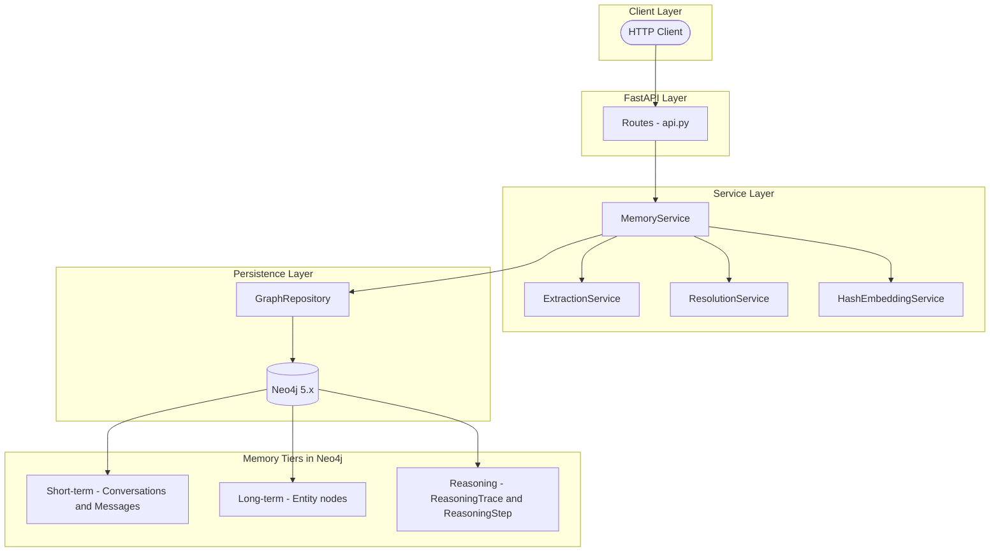
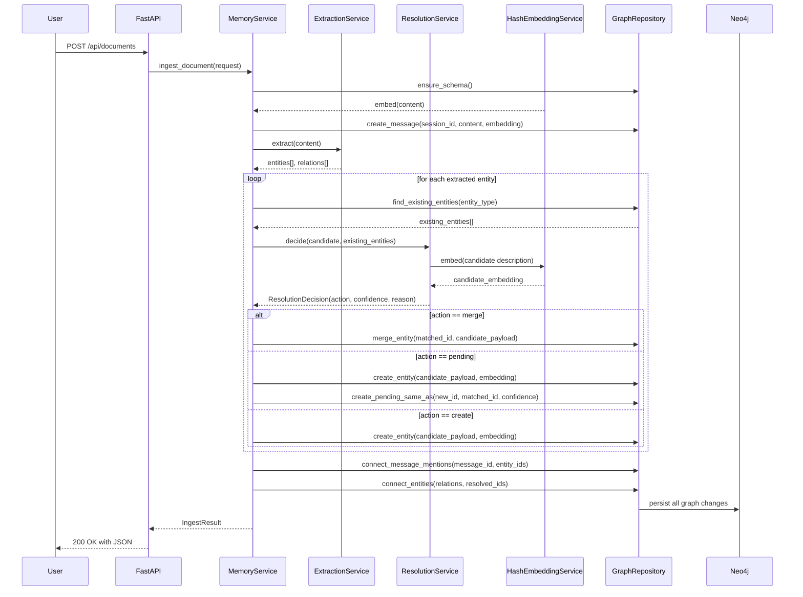
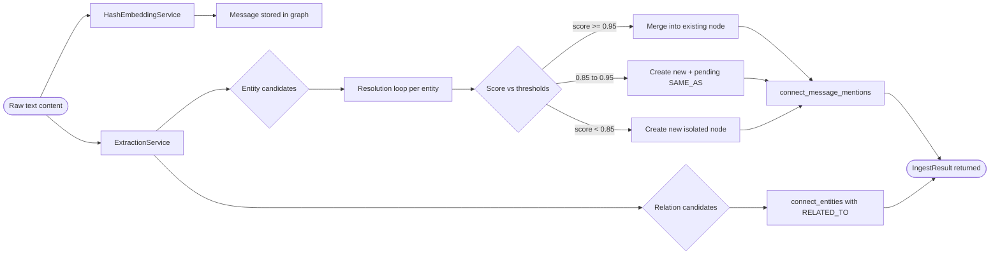
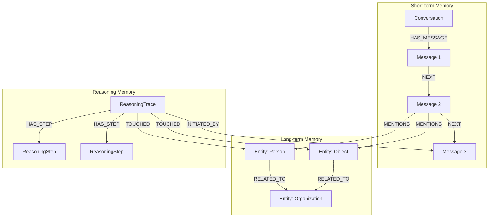
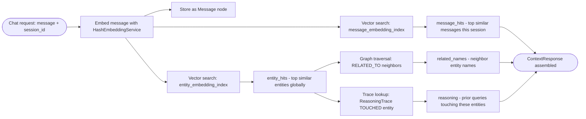

# Vector Index Graph Memory

[](https://www.python.org/)
[](https://fastapi.tiangolo.com/)
[](https://neo4j.com/)
[](https://docs.pydantic.dev/)
[](https://www.docker.com/)
[](#testing-and-validation)
[](LICENSE)
[](docs/architecture.md)

> [!IMPORTANT]
> This is a prototype focused on memory architecture, not a production-ready agent platform. The extraction pipeline is intentionally lightweight, the embedding model is deterministic and local, and the graph writes are designed to demonstrate identity-preserving memory behavior with minimal external dependencies. Use this as a learning reference or starting scaffold, not a drop-in production system.

This project is a graph-native memory system that solves a fundamental problem with how modern AI agents store and recall information. A flat vector index is excellent at finding similar text, but it has no way to know whether two similar-sounding things are actually the same entity. This repository demonstrates an architecture where **identity is managed explicitly in a graph** and **semantic similarity is used only as a search signal**, not as a definition of truth.

The system combines FastAPI, Neo4j 5 vector indexes, a deterministic local embedding service, lightweight entity extraction, and a conservative resolution gate. Each of these pieces addresses a specific weakness in purely vector-based memory systems. If you are evaluating whether this approach makes sense for your use case, the sections below provide enough detail to understand both the benefits and the tradeoffs.

The architecture material in this README is mirrored by the companion document at [docs/architecture.md](docs/architecture.md). The README gives the broader project narrative; the doc keeps a tighter architecture-only reference.

---

## Table of Contents

1. [What Is A Vector Index?](#what-is-a-vector-index)
2. [What Is Graph Memory?](#what-is-graph-memory)
3. [How Does This Compare To Other Approaches?](#how-does-this-compare-to-other-approaches)
4. [Is This Optimal - And For What Situations?](#is-this-optimal---and-for-what-situations)
5. [Why This Project Exists](#why-this-project-exists)
6. [What The System Does](#what-the-system-does)
7. [Tech Stack And Why It Was Chosen](#tech-stack-and-why-it-was-chosen)
8. [Architecture Overview](#architecture-overview)
9. [How Does Ingest Work Step By Step?](#how-does-ingest-work-step-by-step)
10. [Memory Tiers](#memory-tiers)
11. [Identity Resolution Strategy](#identity-resolution-strategy)
12. [Retrieval Strategy](#retrieval-strategy)
13. [Repository Structure](#repository-structure)
14. [Quick Start](#quick-start)
15. [Configuration](#configuration)
16. [API Reference](#api-reference)
17. [Generated API Response Examples](#generated-api-response-examples)
18. [Example Workflows](#example-workflows)
19. [Testing And Validation](#testing-and-validation)
20. [Current Constraints And Tradeoffs](#current-constraints-and-tradeoffs)
21. [When Should You Use This vs Something Else?](#when-should-you-use-this-vs-something-else)
22. [Summary](#summary)

---

## What Is A Vector Index?

A vector index is a data structure that stores numerical representations of text - called **embeddings** - and lets you find the most similar ones quickly. When you embed a sentence, you convert it into a list of numbers (a vector) where sentences with similar meanings end up close together in multi-dimensional space. The classic example: "The cat sat on the mat" and "A feline rested on the rug" would produce vectors that are close to each other even though the words are different.

Vector indexes are used everywhere in modern AI: in retrieval-augmented generation (RAG), semantic search, recommendation systems, and agent memory. They are fast, scalable, and require no manual schema design. The most common operations are **insert** (add a new vector) and **approximate nearest neighbor search** (find the top-k most similar vectors to a query).

> [!NOTE]
> Popular vector databases include Pinecone, Weaviate, Chroma, Qdrant, and FAISS. Neo4j 5 added native vector index support so a graph database can now store both relationships and embeddings on the same nodes, eliminating the need for a separate vector store.

The limitation of a pure vector index is that it treats every stored chunk as isolated. There is no native concept of "this chunk and that chunk are about the same entity." Two different descriptions of the same person will be stored as two separate vectors. Two mentions of a company under different names will never be linked. Retrieval might surface both, but no identity logic exists to say they refer to the same thing. That is the problem this project addresses.

---

## What Is Graph Memory?

Graph memory is a pattern where knowledge is stored as a **property graph** - a network of nodes and edges - rather than as a flat list of chunks or rows in a table. Each node represents an entity (a person, place, organization, event, or object). Each edge represents a relationship between two entities (one person works at one company, one event happened at one location).

The power of graph memory over flat storage is that it preserves **structure**. When you ask "what do we know about Anthropic?" a graph can not only return the Anthropic entity, but also traverse its edges to find related companies, people who work there, products it has created, and events it has been involved in - all without having to embed and search each of those separately.

> [!NOTE]
> The term "memory" in this context refers to persistent structured knowledge that an AI agent can read and write over time, as opposed to the in-context window which only holds the current conversation. Graph memory is a form of long-term external memory.

In this project, graph memory is implemented using **Neo4j 5**, a mature graph database that adds native vector index support in its 5.x releases. That means the same Neo4j instance stores both the graph structure (nodes, edges, properties) and the vector embeddings (stored as node properties and indexed for similarity search). This is architecturally significant: you do not need a separate vector store. Identity, relationships, and semantic search all live together.

The graph also stores **reasoning traces** - records of which entities were touched during a retrieval operation and why. This is provenance: the ability to explain where retrieved context came from and retrace the reasoning path later.

---

## How Does This Compare To Other Approaches?

There are several common ways to build memory for AI agents, each with different strengths. Understanding the tradeoff space helps you decide which approach fits your situation.

> [!NOTE]
> The table below is a comparison across five memory patterns. None of these is universally best. The right choice depends on whether you need identity preservation, multi-hop traversal, operational simplicity, or semantic recall quality.

| # | Approach | Identity Modeling | Relationship Traversal | Semantic Recall | Operational Complexity | Best For |
| --- | --- | --- | --- | --- | --- | --- |
| 1 | Flat vector store (Chroma, Pinecone) | None - chunks are isolated | None | Excellent with modern embeddings | Low - single service | Pure document retrieval with no entity identity needs |
| 2 | Relational DB (Postgres, SQLite) | Strong via primary keys and foreign keys | Poor for deep traversal | Requires extension or separate vector store | Medium - familiar tooling | Structured data with well-defined schemas |
| 3 | In-memory object graph (Python dicts) | Moderate - depends on implementation | Good within a single session | None unless you add embeddings manually | Very low | Short sessions, rapid prototyping, no durability needed |
| 4 | Knowledge graph only (RDF, SPARQL) | Excellent - formal ontology | Excellent - multi-hop queries | Poor - requires bolted-on embedding layer | High - formal schema and query language | Formal knowledge bases with strict ontology |
| 5 | This project - hybrid graph plus vector | Explicit merge gate with conservative thresholds | Good via RELATED_TO and SAME_AS edges | Good - deterministic local embeddings | Medium - Neo4j plus FastAPI | Agent memory where identity drift is a risk |

> [!TIP]
> If you are building a simple RAG pipeline over static documents, a flat vector store is faster to set up and sufficient. This project is most valuable when your agent accumulates knowledge over time and you need stable references to the same entities across many conversations.

A critical distinction is what happens when the same entity appears under different names or descriptions. In a flat vector store, "OpenAI" and "Open AI" and "the company that made GPT-4" become three separate vectors with no link. In this system, all three would be candidates for merging into a single canonical entity node, with the decision made by the resolution gate rather than silently assumed.

---

## Is This Optimal - And For What Situations?

This is one of the most important questions to answer honestly. The short answer: **this system is optimal for a specific problem profile, not universally optimal**.

> [!IMPORTANT]
> If semantic recall quality over large document corpora is your primary goal, a dedicated vector store with a strong embedding model will outperform this prototype. The deterministic hash embeddings used here sacrifice recall quality for reproducibility and zero external dependencies.

The system is well-suited when all of the following are true:

- You have an AI agent that accumulates knowledge over time across many sessions

- Entities (people, companies, tools, events) appear repeatedly under different names or descriptions

- Incorrect merges are costly - you need a human review pathway for ambiguous cases

- You need to explain why certain context was retrieved, not just what was retrieved

- You want to store relationships between entities, not just similarity scores

The system is less well-suited when:

- You need the highest possible semantic recall quality over large document sets

- You have no entities - just raw text chunks with no identity semantics

- Operational simplicity is a hard requirement (Neo4j adds infrastructure overhead)

- You cannot tolerate the conservative merge policy creating duplicate nodes

| # | Situation | Recommended Approach | Why This Project Fits or Does Not |
| --- | --- | --- | --- |
| 1 | Static document search over PDFs and articles | Flat vector store with strong embeddings | No identity management needed; vector recall is the whole problem |
| 2 | Agent with growing personal knowledge base | This project or similar hybrid | Entity identity and relationship traversal matter as knowledge grows |
| 3 | Customer support bot with product catalog | Relational DB plus vector search | Schema is well-defined; relational constraints are valuable |
| 4 | Research assistant tracking people and orgs over time | This project is a good fit | Same entities appear under many names; merge decisions need human review |
| 5 | Real-time chat with no persistent memory | In-context window only | Persistence overhead is wasted if memory does not outlive the session |

> [!NOTE]
> The most honest framing is this: this project trades peak recall performance for identity safety. It is the right trade when you are building a system where wrong merges cause real harm, and where explainability matters more than raw retrieval speed.

---

## Why This Project Exists

A flat vector index is excellent for fuzzy retrieval, but it tends to blur identity boundaries. If two mentions are semantically close, a naive system may treat them as the same thing even when they should remain distinct. That becomes a memory bug, not just a retrieval bug. And memory bugs in AI agents are insidious: they accumulate silently, affect all future reasoning that draws on the corrupted memory, and are hard to detect because the agent will answer confidently based on the wrong merged entity.

The classic failure mode looks like this: an agent hears "Sam Altman leads OpenAI" and "Sam Adams is a beer brand." Because both involve someone named Sam, a pure similarity-based system with a low merge threshold might conflate these into one entity. Future queries about Sam Altman might return beer facts. The agent has no way to know this happened.

In this repository, identity lives in the graph and similarity remains a signal. That distinction is the central design choice. It makes the system more conservative than a pure semantic search stack, but it also makes it safer for agent memory where stable references matter over time.

| # | Decision Area | Chosen Approach | Typical Alternative | Why This Helps |
| --- | --- | --- | --- | --- |
| 1 | Primary memory store | Neo4j graph with vector indexes | Standalone vector database | Keeps identity, relationships, and embeddings on the same node set |
| 2 | Entity identity | Explicit node identity with merge gate | Similarity-only matching | Reduces accidental collapse of near matches into one memory |
| 3 | Reasoning retention | Reasoning traces stored in the graph | Prompt-only transient chain of thought | Preserves provenance about how context was assembled |
| 4 | Retrieval model | Hybrid graph plus vector retrieval | Top-k embedding recall only | Combines semantic recall with neighborhood expansion and provenance |
| 5 | Dedup behavior | Merge, pending review, or create | Always merge when similar enough | Adds a safety band for ambiguous cases that need human judgment |

> [!NOTE]
> The conservative deduplication gate is the key architectural difference from simpler systems. It exists because memory systems often fail gradually through incorrect merges, and those errors are harder to recover from than missed links. A missed link means one extra node; a wrong merge means corrupted identity forever.

---

## What The System Does

At a high level, the service ingests text, extracts candidate entities and relationships from it, resolves those candidates against existing graph nodes using a layered scoring approach, stores the message in short-term memory, stores entities in long-term memory with their embeddings and relationships, and then retrieves context by mixing semantic search with graph traversal. During chat requests, it also records a reasoning trace that points back to the message and the entities that were touched during retrieval.

This is deliberately different from a typical RAG pipeline. In a typical RAG system, text is chunked, embedded, stored, and retrieved by similarity. There is no entity extraction, no identity resolution, no relationship storage, and no provenance. This system adds all four layers on top of the embedding foundation.

| # | Capability | What It Does | Why It Is Needed |
| --- | --- | --- | --- |
| 1 | Document ingest | Stores a message, extracts entities, resolves duplicates, and writes relationships | Turns raw notes into structured graph memory with stable identity |
| 2 | Chat context retrieval | Stores a user message and returns message hits, entity hits, neighbors, and related reasoning | Lets a downstream assistant retrieve grounded, multi-tier context |
| 3 | Duplicate review | Confirms or rejects pending SAME_AS links | Provides a human checkpoint for ambiguous identity cases before they corrupt memory |
| 4 | Health reporting | Checks whether Neo4j is reachable and the service is running | Separates service availability from storage connectivity for clean monitoring |
| 5 | Graph statistics | Returns counts for conversations, messages, entities, traces, and pending duplicates | Gives a fast operational snapshot of memory growth and pending review items |

> [!TIP]
> The pending duplicates count in the stats response is a useful health indicator. If it grows without bound, it means the extraction pipeline is generating many ambiguous candidates that are not being reviewed. That warrants tuning the resolution thresholds or improving the reviewer workflow.

---

## Tech Stack And Why It Was Chosen

The technology choices in this repository are intentional and each one serves the architecture rather than being chosen for familiarity or popularity. Understanding why each piece is here helps you know what to replace if your requirements differ.

**FastAPI** was chosen because it provides typed request and response models via Pydantic, generates interactive OpenAPI documentation automatically, handles dependency injection cleanly, and uses Python type hints throughout which makes the codebase easier to read. The alternative would be Flask or Django, but neither provides the same out-of-the-box Pydantic integration.

**Neo4j 5.x** was chosen because it is the only major graph database that natively supports both labeled property graphs with typed edges and vector similarity indexes on the same nodes. This eliminates the need for a separate vector store while keeping the graph structure. Earlier versions of Neo4j required a plugin for vector search; version 5 makes it a first-class feature.

**Local deterministic hash embeddings** were chosen to remove all external dependencies and make tests reproducible. A hash-based embedding function always produces the same vector for the same input string, which means tests can assert on exact embedding values and similarity scores without mocking an API. The tradeoff is lower semantic quality compared to a trained model like `text-embedding-3-small`, but this can be swapped behind the same service interface.

**Pydantic v2** was chosen for all schema definitions because it provides fast validation, clear error messages, and automatic JSON serialization. Every request and response shape in the API is a Pydantic model, which means the contract is self-documenting and the serialization is handled automatically.

| # | Layer | Technology | Why It Was Chosen | Practical Consequence |
| --- | --- | --- | --- | --- |
| 1 | API layer | FastAPI | Typed request models, automatic OpenAPI docs, simple dependency wiring | Interactive docs at /docs with no extra boilerplate |
| 2 | Data validation | Pydantic v2 | Keeps API contracts explicit, fast validation, automatic JSON handling | Request and response shapes are self-documenting and testable |
| 3 | Graph store | Neo4j 5.x | Supports graph traversal and vector index queries in the same database | No separate vector service needed; identity and embeddings coexist |
| 4 | Embedding service | Local deterministic hash embedding | Removes external API cost and makes tests deterministic | Semantic quality is lower than learned models but reproducibility is high |
| 5 | Extraction strategy | Regex and heuristic extraction | Keeps the prototype easy to run and inspect without NLP dependencies | Coverage is limited - a scaffold for replacing with spaCy or a fine-tuned model |
| 6 | Test stack | Pytest plus FastAPI TestClient | Supports narrow deterministic tests without requiring a live Neo4j | Core behavior can be validated locally before doing full end-to-end runs |
| 7 | Container runtime | Docker Compose | Provides a one-command local Neo4j instance with predictable configuration | No manual Neo4j installation needed to start working |

> [!NOTE]
> The local hash embedding is the most significant quality compromise in the current implementation. Hash-based embeddings map text to vectors using character n-gram frequencies rather than learned semantic representations. They capture some surface similarity but miss conceptual relationships. Replacing this with a real embedding model is the highest-leverage improvement you can make to this system.

---

## Architecture Overview

The architecture is organized around a clear layered boundary. Requests enter through FastAPI routes, which delegate all business logic to `MemoryService`. The service layer coordinates four subordinate services: embedding, extraction, resolution, and the graph repository. The repository layer owns all Cypher queries and Neo4j interactions. Nothing outside the repository layer touches the database directly.

This separation matters because it makes each layer independently testable. The resolution service can be tested with mock entities and mock embeddings. The extraction service can be tested on raw strings. The API routes can be tested with a mock memory service. The only layer that requires a real Neo4j is the repository.

If Mermaid does not render in your viewer, the static fallback image shows the same control flow. The architecture reference in [docs/architecture.md](docs/architecture.md) reuses the same SVG.




> [!NOTE]
> The `MemoryService` is the only class that touches all four subordinate services. No route handler calls the graph repository directly. This means the API layer has zero knowledge of Cypher, embeddings, or resolution logic - it only speaks request and response models.

The sequence diagram below shows the complete ingest flow end to end, including the per-entity resolution loop that is the heart of the system.



> [!IMPORTANT]
> The loop in the sequence diagram above runs once per extracted entity. If a document mentions ten entities, the system makes ten resolution decisions. For each one it queries Neo4j for same-type existing entities, computes scores, and decides whether to merge, flag as pending, or create new. This is intentionally synchronous and conservative.

---

## How Does Ingest Work Step By Step?

This section explains the ingest pipeline in detail because it is the most complex flow in the system and understanding it is necessary to evaluate whether the architecture is right for your use case.

**Step 1 - Schema setup.** Before any write, the service calls `ensure_schema()` which creates the necessary Neo4j constraints and vector indexes if they do not exist. This is idempotent - it is safe to call every time because Neo4j ignores index and constraint creation if they already exist.

**Step 2 - Message embedding and storage.** The raw content text is embedded using the hash embedding service to produce a 256-dimensional vector. The message is then stored as a `Message` node attached to the `Conversation` node for this session, with the embedding stored as a node property and indexed in the `message_embedding_index`. This makes the message retrievable by semantic similarity in future chat calls.

**Step 3 - Entity and relation extraction.** The extraction service runs regex and heuristic patterns over the content to produce a list of `EntityCandidate` objects (each with a name, type, aliases, and description) and a list of `RelationCandidate` objects (each with a subject name, predicate, and object name).

**Step 4 - Entity resolution loop.** For each extracted entity, the system queries Neo4j for all existing entities of the same top-level type. It then runs the resolution logic: exact name match, fuzzy string match, and semantic embedding similarity. The three signals are combined into a single score. Depending on the score and configured thresholds, the entity is merged into an existing node, created as a new node with a pending `SAME_AS` edge to the closest match, or created as a new isolated node.

**Step 5 - Graph connection.** After all entities are resolved, the service connects the message node to each entity node with `MENTIONS` edges, and connects entity pairs from the extracted relations with `RELATED_TO` edges labeled with the extracted predicate.

> [!NOTE]
> The resolution decision is the only step in the pipeline that has side effects beyond the current request. A merge permanently modifies an existing entity node. A pending decision creates a new `SAME_AS` edge that will remain in the graph until a reviewer acts on it. Create decisions are the safest because they add a new node without touching anything existing.



> [!TIP]
> If you want to understand what the resolution service is actually doing on a given ingest, look at the `resolutions` array in the `IngestResult` response. Each entry shows the action taken, the confidence score, and the human-readable reason string that explains the exact score breakdown (e.g., `exact=0.00, fuzzy=0.91, semantic=0.87`).

---

## Memory Tiers

The system deliberately separates storage into three distinct tiers rather than mixing everything into one undifferentiated index. This separation is essential for keeping different kinds of memory from contaminating each other. A message in a conversation from three weeks ago should not be treated the same as a stable fact about a well-known entity. A reasoning trace from a previous retrieval session should not be confused with an entity relationship.

**Short-term memory** holds `Conversation` and `Message` nodes. A conversation groups messages from the same session. Messages are linked in sequence with `NEXT` edges and each message has an embedding stored for vector retrieval. This tier is temporal and session-scoped.

**Long-term memory** holds `Entity` nodes with POLE+O type labels (Person, Object, Location, Event, Organization). These nodes accumulate canonical names, aliases, descriptions, embeddings, and typed edges. This tier persists across sessions and is the main knowledge base of the system.

**Reasoning memory** holds `ReasoningTrace` and `ReasoningStep` nodes. When a chat request triggers a retrieval query, the system records which message initiated the trace, which steps were taken, and which entities were touched. This makes retrieval behavior inspectable and auditable over time.

| # | Tier | Main Node Types | Edges Used | Lifetime | Why It Exists As A Separate Tier |
| --- | --- | --- | --- | --- | --- |
| 1 | Short-term | Conversation, Message | HAS_MESSAGE, NEXT, MENTIONS | Session-scoped, grows with each ingest | Conversational flow is temporal and should not pollute entity identity |
| 2 | Long-term | Entity with POLE+O labels | RELATED_TO, SAME_AS | Persistent across all sessions | Entity knowledge must be stable and addressable by canonical name |
| 3 | Reasoning | ReasoningTrace, ReasoningStep | INITIATED_BY, HAS_STEP, TOUCHED | Permanent audit log | Provenance about retrieval behavior must be separate from entity state |



> [!NOTE]
> POLE+O stands for Person, Object, Location, Event, Organization. This is a coarse ontology that covers the most common entity categories in natural language text. It is used as the top-level type filter during resolution: the system only compares an entity candidate against existing entities of the same POLE+O type. This prevents a person named "London" from being matched against the city "London."

---

## Identity Resolution Strategy

Identity resolution is the central algorithmic challenge in this system. The question being answered for each extracted entity is: "Does this candidate refer to something that already exists in our graph, or is it something new?" Getting this wrong in either direction has costs. A false merge corrupts existing entity data. A false split creates a duplicate node that fragments knowledge.

The system addresses this by layering three signals rather than relying on any one of them alone. Exact string matching catches the obvious cases. Fuzzy string matching catches spelling variants and minor formatting differences. Semantic cosine similarity catches conceptual relatedness when surface forms differ substantially. The three signals are combined with a weighted formula and the result is mapped to one of three outcomes.

**Signal 1 - Exact match** compares the candidate name and all its aliases against the existing entity's name and aliases, case-insensitively. An exact match produces a score of 1.0 and immediately triggers the merge check.

**Signal 2 - Fuzzy match** uses Python's `difflib.SequenceMatcher` to compute a ratio between the candidate name and the existing entity's name and aliases. This handles cases like "GPT4" vs "GPT-4" or "Sam Altman" vs "Samuel Altman."

**Signal 3 - Semantic match** embeds the candidate using the description and type context (not just the name) and computes cosine similarity against the existing entity's embedding. This captures cases where surface names differ substantially but the contextual descriptions are similar.

| # | Signal | Implementation | Captures | Weight In Formula | Why This Weight |
| --- | --- | --- | --- | --- | --- |
| 1 | Exact match | Case-insensitive name and alias comparison | Literal identity agreement | Overrides others if 1.0 | Exact matches should always merge regardless of other signals |
| 2 | Fuzzy match | difflib.SequenceMatcher ratio | Surface-form similarity and typos | 0.45 | Less reliable than semantics for capturing meaning differences |
| 3 | Semantic match | Cosine similarity over hash embeddings | Contextual resemblance | 0.55 | More reliable for catching entity equivalence across different phrasings |
| 4 | Type filter | Same entity_type only | Coarse ontology guardrail | N/A - acts as gate before scoring | Prevents cross-category false matches entirely |

The scoring formula for the best non-exact candidate is:

$$
score = \max\left(exact,\ 0.45 \times fuzzy + 0.55 \times semantic\right)
$$

Cosine similarity for two unit vectors $u$ and $v$ with dimension $n$:

$$
\mathrm{cosine}(u, v) = \sum_{i=1}^{n} u_i v_i
$$

The decision thresholds are:

$$
\text{merge if } score \ge 0.95
$$

$$
\text{pending review if } 0.85 \le score < 0.95
$$

$$
\text{create new if } score < 0.85
$$

| # | Score Band | Graph Action | Human Review Required | Why This Band Exists |
| --- | --- | --- | --- | --- |
| 1 | score >= 0.95 | Merge into canonical node, absorb aliases | No - automatic | Only very strong evidence should auto-collapse identity |
| 2 | 0.85 to 0.95 | Create new node, add pending SAME_AS edge | Yes - via /api/duplicates/review | Ambiguous cases need a human decision rather than silent auto-merge |
| 3 | score < 0.85 | Create new isolated entity node | No - treated as new | Weak evidence should not rewrite existing identity |

> [!IMPORTANT]
> The `source` field on `DocumentIngestRequest` is accepted at the API boundary but is not yet stored in the graph in this prototype. This is a known gap documented in the constraints section. The graph writes use session_id and content but do not attach a source provenance label to the message node.
> [!WARNING]
> Lowering `AUTO_MERGE_THRESHOLD` below 0.90 significantly increases the risk of incorrect merges. The 0.95 default was chosen because hash-based embeddings have lower semantic fidelity than learned models, so a higher bar compensates for noisy similarity scores. If you replace the embedding service with a stronger model, you may be able to safely lower this threshold.

---

## Retrieval Strategy

The retrieval strategy is designed to return multiple types of context in a single response rather than a flat list of similar chunks. This is what makes graph-backed memory qualitatively different from vector-only retrieval.

When a chat request arrives, the system does four things in sequence. First, it stores the current message as a `Message` node with its embedding, so future queries will find it. Second, it runs a vector similarity search over all messages in the current session to find the most relevant prior messages. Third, it runs a vector similarity search over all entity nodes globally to find the most relevant long-term knowledge. Fourth, it traverses the `RELATED_TO` edges from each returned entity to pull in graph neighbors, then looks up any `ReasoningTrace` nodes that previously touched the returned entities.

The result is a `ContextResponse` with four fields: `message_hits` (semantically relevant messages), `entities` (relevant entity nodes with similarity scores), `related_names` (graph neighbors of the hit entities), and `reasoning` (prior retrieval queries that touched these entities).

| # | Retrieval Step | Index Used | What It Returns | Why It Is Included |
| --- | --- | --- | --- | --- |
| 1 | Message vector search | message_embedding_index | Relevant messages from the same session | Session history gives temporal context for the current question |
| 2 | Entity vector search | entity_embedding_index | Entity nodes with similarity scores | Long-term knowledge about named entities crosses session boundaries |
| 3 | Neighbor expansion | RELATED_TO graph traversal | Entities one hop away from the hit set | Adds structural context; not just isolated hits but their connections |
| 4 | Reasoning trace lookup | ReasoningTrace to Entity links | Prior retrieval queries that touched similar entities | Provides provenance and shows how the agent has previously used this knowledge |

> [!NOTE]
> The neighbor expansion step is what distinguishes hybrid graph-vector retrieval from pure vector retrieval. If you ask "what do we know about Anthropic?", pure vector search returns nodes similar to "Anthropic". Neighbor expansion additionally returns Claude, Claude Code, and any other entities connected to Anthropic by `RELATED_TO` edges - even if those entities were not semantically close to your query.



---

## Repository Structure

The repository layout mirrors the conceptual architecture. Code is not grouped by file type but by responsibility. This makes it easier to find the code responsible for a specific behavior and to replace individual layers without touching others.

| # | Path | Responsibility | What Lives Here |
| --- | --- | --- | --- |
| 1 | app/main.py | Application assembly and dependency wiring | FastAPI app creation, service instantiation, config loading |
| 2 | app/routes/api.py | HTTP route definitions | All endpoint handlers, request validation, error handling |
| 3 | app/services/memory.py | Ingest and chat orchestration | MemoryService coordinating all subordinate services |
| 4 | app/services/embedding.py | Vector generation and similarity | HashEmbeddingService with cosine similarity |
| 5 | app/services/extraction.py | Entity and relation extraction | ExtractionService with regex and heuristic patterns |
| 6 | app/services/resolution.py | Duplicate detection and merge decisions | ResolutionService with multi-signal scoring |
| 7 | app/repositories/graph.py | All Neo4j interactions | GraphRepository with schema, writes, and retrieval Cypher |
| 8 | app/models/schemas.py | Pydantic data models | All request, response, and internal data schemas |
| 9 | tests/ | Unit and integration tests | Deterministic tests without Neo4j; API client tests with mocks |
| 10 | docs/ | Architecture reference | Companion architecture.md and static SVG diagram |

The same component boundaries are summarized in [docs/architecture.md](docs/architecture.md#component-responsibilities).

---

## Quick Start

The setup favors local reproducibility over cloud dependency. Docker Compose provides Neo4j with a single command, and the application itself only needs a Python virtual environment. The entire local stack requires no cloud accounts, no API keys, and no paid services.

### Step 1 - Start Neo4j

```bash
docker compose up -d
```

This starts `neo4j:5.26` in a container, exposes the Bolt interface on port `7687` and the browser UI on port `7474`. Neo4j will take a few seconds to initialize. You can check readiness by visiting `http://localhost:7474` in a browser.

### Step 2 - Create and activate a virtual environment

```bash
python -m venv .venv
source .venv/bin/activate   # Linux / macOS
# .venv\Scripts\activate    # Windows
```

### Step 3 - Install the package and development dependencies

```bash
pip install -e .[dev]
```

The `-e` flag installs in editable mode so you can edit source files and see changes without reinstalling. The `[dev]` extras include pytest and the test dependencies.

### Step 4 - Run the API server

```bash
uvicorn app.main:app --reload
```

The `--reload` flag watches for source file changes and restarts the server automatically. This is useful during development but should not be used in production.

### Step 5 - Open the interactive docs

```text
http://127.0.0.1:8000/docs
```

FastAPI generates a full interactive Swagger UI from the Pydantic models. You can send requests directly from the browser without needing curl or a separate API client.

| # | Runtime Dependency | Required Version | Why It Is Needed | Default Source |
| --- | --- | --- | --- | --- |
| 1 | Python | 3.12 or newer | Project metadata and type annotations require 3.12+ | System Python or pyenv |
| 2 | Docker or Podman | Any current version | Runs Neo4j locally with configured ports | docker-compose.yml in repo root |
| 3 | Neo4j | 5.x (via Docker) | Graph persistence and vector index support | neo4j:5.26 from docker-compose.yml |
| 4 | Virtual environment | Any | Isolates app and test dependencies from system Python | Local .venv directory |

> [!TIP]
> If the API starts but `/api/health` returns a degraded status, check whether Neo4j is reachable at `bolt://localhost:7687` and whether the password matches the configured environment variables. The most common cause is the container not yet having finished its startup sequence.

---

## Configuration

The application loads all runtime settings from environment variables. Sensible defaults are provided for every variable so the service runs out of the box in a local development environment without any `.env` file. The defaults are designed to match the `docker-compose.yml` configuration in the repository.

| # | Variable | Default Value | What It Controls | When To Change It |
| --- | --- | --- | --- | --- |
| 1 | NEO4J_URI | bolt://localhost:7687 | Neo4j Bolt connection endpoint | Point to a remote or Docker-networked Neo4j instance |
| 2 | NEO4J_USERNAME | neo4j | Database username | Match your hosted Neo4j credentials |
| 3 | NEO4J_PASSWORD | change-this-password | Database password | Always change in any non-local environment |
| 4 | MEMORY_EMBEDDING_DIMENSIONS | 256 | Length of generated embedding vectors | Change if swapping in a different embedding model with different dimensions |
| 5 | AUTO_MERGE_THRESHOLD | 0.95 | Minimum score for automatic entity merge | Raise to be more conservative; lower if using a stronger embedding model |
| 6 | PENDING_MATCH_THRESHOLD | 0.85 | Minimum score to flag a match for human review | Lower to increase the number of matches flagged for review |

Example local `.env` file that matches the defaults:

```env
NEO4J_URI=bolt://localhost:7687
NEO4J_USERNAME=neo4j
NEO4J_PASSWORD=change-this-password
MEMORY_EMBEDDING_DIMENSIONS=256
AUTO_MERGE_THRESHOLD=0.95
PENDING_MATCH_THRESHOLD=0.85
```

> [!WARNING]
> The default password `change-this-password` is only safe for local development. If you expose the Neo4j port outside your local machine, change this immediately. Neo4j does not restrict connections by IP by default.

---

## API Reference

The API surface is small and intentional. Each endpoint corresponds to exactly one part of the memory lifecycle. There are no bulk endpoints, no admin endpoints, and no authentication middleware in this prototype.

### GET /api/health- Check service and database connectivity

**Purpose:** Returns the operational status of the API service and whether the Neo4j database is reachable. This endpoint does not require any request body.

**Response shape:**

```json
{
  "status": "ok",
  "neo4j": "connected"
}
```

**When to use:** Call this before running any operations to confirm the service is up and the database connection is healthy. Use it as a readiness probe in deployment environments.

**Note:** If `neo4j` returns `"disconnected"` the API is running but cannot reach the database. Check your `NEO4J_URI` and confirm the container is healthy.

### POST /api/documents- Ingest text and build graph memory

**Purpose:** Takes a raw text document, extracts entities and relationships, resolves candidates against existing graph nodes, and persists the results. This is the main write operation in the system.

**Request body:**

```json
{
  "content": "Anthropic developed Claude Code. Claude Code competes with Codex.",
  "source": "example-note",
  "session_id": "demo"
}
```

**Response shape:**

```json
{
  "message_id": "9ca7c7b5-8a96-4f81-a5ff-0e1d5b991c2e",
  "entity_count": 3,
  "relation_count": 2,
  "resolutions": [
    {
      "action": "create",
      "confidence": 0.0,
      "matched_entity_id": null,
      "matched_name": null,
      "reason": "No same-type candidates exist yet."
    },
    {
      "action": "pending",
      "confidence": 0.89,
      "matched_entity_id": "entity:claude-code",
      "matched_name": "Claude Code",
      "reason": "exact=0.00, fuzzy=0.91, semantic=0.87"
    }
  ]
}
```

**When to use:** Call this whenever new text should be added to the agent's memory. Each call creates a message node, resolves entities, and builds relationships.

**Note:** The `resolutions` array tells you exactly what the system decided for each extracted entity and why. Check `action: "pending"` entries to see which entities need human review.

### POST /api/chat- Retrieve hybrid context for a user message

**Purpose:** Stores the user's message in the graph and returns a multi-tier context response combining message history, entity knowledge, and reasoning provenance.

**Request body:**

```json
{
  "message": "What do we know about Claude Code?",
  "session_id": "demo"
}
```

**Response shape:**

```json
{
  "query": "What do we know about Claude Code?",
  "session_id": "demo",
  "message_hits": [
    "Anthropic developed Claude Code.",
    "Claude Code competes with Codex."
  ],
  "entities": [
    {
      "id": "entity:claude-code",
      "name": "Claude Code",
      "entity_type": "Object",
      "score": 0.97,
      "related_names": ["Anthropic", "Codex"]
    },
    {
      "id": "entity:anthropic",
      "name": "Anthropic",
      "entity_type": "Organization",
      "score": 0.88,
      "related_names": ["Claude Code"]
    }
  ],
  "reasoning": [
    "What do we know about Claude Code?"
  ]
}
```

**When to use:** Call this on every user message turn to retrieve relevant context for your LLM. Pass the returned context as part of the system prompt or user context window.

### POST /api/duplicates/review- Confirm or reject a pending identity link

**Purpose:** Resolves a pending `SAME_AS` edge between two entity nodes. A confirmation merges the entities; a rejection marks the edge as rejected and keeps the entities separate.

**Request body:**

```json
{
  "left_id": "entity:claude-code-v2",
  "right_id": "entity:claude-code",
  "confirm": true,
  "reviewer": "human-reviewer-id"
}
```

**When to use:** Call this when reviewing the `pending_duplicates` count from the stats endpoint. Each pending duplicate represents an ambiguous identity match that the system flagged for human judgment.

**Note:** Confirming a duplicate merges the left entity into the right entity and rewrites the `SAME_AS` edge status to `confirmed`. Rejecting marks it as `rejected` and ensures the two entities remain permanently separate, which prevents the resolution service from flagging them as candidates again.

### GET /api/stats- Get current graph memory statistics

**Purpose:** Returns a snapshot of the current graph state including counts for every major node type and the number of pending duplicate reviews.

**Response shape:**

```json
{
  "conversations": 4,
  "messages": 18,
  "entities": 9,
  "traces": 6,
  "pending_duplicates": 1,
  "checked_at": "2026-06-03T12:00:00Z"
}
```

**When to use:** Use this endpoint to monitor memory growth over time and to check whether pending duplicates are accumulating. High `pending_duplicates` values indicate that the resolution thresholds may need tuning or that more frequent human review is needed.

> [!TIP]
> The FastAPI-generated docs at `http://127.0.0.1:8000/docs` give you an interactive way to test every endpoint without curl. Each endpoint shows its full schema, required fields, and example values derived from the Pydantic models.

---

## Generated API Response Examples

These response examples were generated directly from the actual Pydantic models in the codebase. They match the current response shapes exactly rather than being hand-authored approximations.

### Health check

```json
{
  "status": "ok",
  "neo4j": "connected"
}
```

The health response is minimal by design. Its purpose is to give a deployment environment a lightweight reachability check that does not require any graph state.

### Stats snapshot

```json
{
  "conversations": 4,
  "messages": 18,
  "entities": 9,
  "traces": 6,
  "pending_duplicates": 1,
  "checked_at": "2026-06-03T12:00:00Z"
}
```

The stats response reflects the actual growth of the graph. The `pending_duplicates` field is the most operationally significant: it tells you how many entity pairs are waiting for human review before they can be merged or separated.

### Document ingest

```json
{
  "message_id": "9ca7c7b5-8a96-4f81-a5ff-0e1d5b991c2e",
  "entity_count": 3,
  "relation_count": 2,
  "resolutions": [
    {
      "action": "create",
      "confidence": 0.0,
      "matched_entity_id": null,
      "matched_name": null,
      "reason": "No same-type candidates exist yet."
    },
    {
      "action": "pending",
      "confidence": 0.89,
      "matched_entity_id": "entity:claude-code",
      "matched_name": "Claude Code",
      "reason": "exact=0.00, fuzzy=0.91, semantic=0.87"
    }
  ]
}
```

The ingest response exposes the internal decision logic for every extracted entity. The `reason` string shows the exact score breakdown so you can see how the combined signal was computed and why the threshold boundary was crossed.

### Chat context

```json
{
  "query": "What do we know about Claude Code?",
  "session_id": "demo",
  "message_hits": [
    "Anthropic developed Claude Code.",
    "Claude Code competes with Codex."
  ],
  "entities": [
    {
      "id": "entity:claude-code",
      "name": "Claude Code",
      "entity_type": "Object",
      "score": 0.97,
      "related_names": ["Anthropic", "Codex"]
    },
    {
      "id": "entity:anthropic",
      "name": "Anthropic",
      "entity_type": "Organization",
      "score": 0.88,
      "related_names": ["Claude Code"]
    }
  ],
  "reasoning": [
    "What do we know about Claude Code?"
  ]
}
```

The chat response combines four retrieval signals into one payload. A downstream LLM can use `message_hits` for conversational context, `entities` for structured facts, `related_names` for graph neighborhood context, and `reasoning` for provenance about how this context was previously used.

---

## Example Workflows

### Workflow 1: Ingesting a note with multiple entities

You post a document: "Anthropic developed Claude Code. Claude Code competes with Codex." The system stores the message, extracts three entities (Anthropic, Claude Code, Codex) and two relations (Anthropic developed Claude Code; Claude Code competes with Codex). If no entities of these types exist yet, all three are created as new isolated nodes with embeddings. Two `RELATED_TO` edges are created between them. The response shows three `action: "create"` resolution decisions.

The next time you post "OpenAI made Codex, a code completion tool", the extraction service finds Codex and OpenAI. The resolution service compares Codex against existing entities of type Object and finds the existing Codex node. If the similarity score is above 0.95, it merges. If between 0.85 and 0.95, it creates a pending review. The response shows one resolution decision for each entity with the full score breakdown.

### Workflow 2: Asking a question across sessions

A user in session `demo` asks "What do we know about Claude Code?" The system stores this message, embeds it, and runs four retrieval operations. The message vector search finds the two previously ingested messages about Claude Code with high similarity scores. The entity vector search finds the Claude Code entity node and the Anthropic entity node. Neighbor expansion adds Codex as a related entity. The reasoning trace lookup finds any prior queries that touched these entities. All four sets of results are assembled into a single `ContextResponse`.

A downstream LLM receives this structured context and can ground its answer in it without needing to re-derive the relationships from scratch.

### Workflow 3: Handling a duplicate detection

The system ingests "Claude Code by Anthropic" and "Claude Code - the AI coding assistant". Both mentions extract to an Object entity named "Claude Code". The first creates a new node. The second finds the existing node and scores it. If the score is 0.89, it creates a pending `SAME_AS` edge and returns `action: "pending"` in the resolution array.

A human reviewer calls `GET /api/stats`, sees `pending_duplicates: 1`, calls `POST /api/duplicates/review` with `confirm: true`, and the entities are merged. The `SAME_AS` edge is updated to `confirmed`. Future extractions of "Claude Code" will merge into the canonical node automatically if the score is above the auto-merge threshold.

| # | Workflow | Services Involved | Graph Changes | Key Output Field |
| --- | --- | --- | --- | --- |
| 1 | First-time ingest of new entities | MemoryService, ExtractionService, ResolutionService, GraphRepository | Message node, N entity nodes, M RELATED_TO edges | resolutions[*].action == "create" |
| 2 | Re-ingest with merge decisions | Same plus HashEmbeddingService for scoring | Existing entity updated or new node plus pending SAME_AS | resolutions[*].action in merge, pending |
| 3 | Chat retrieval across memory tiers | MemoryService, HashEmbeddingService, GraphRepository | New Message node, new ReasoningTrace node | message_hits, entities, reasoning |
| 4 | Human duplicate review | GraphRepository only | SAME_AS edge status updated, entity merged or separated | HTTP 200 on success |

---

## Testing And Validation

The test suite is designed to validate deterministic behavior without requiring a running Neo4j instance. This is possible because the embedding service is hash-based (deterministic), the extraction service is regex-based (deterministic), and the API routes are tested with a mock `MemoryService` that returns predictable responses.

The five test cases cover the core invariants of the system: embedding stability, similarity ordering, extraction correctness, API health shape, and API stats shape. These tests are not comprehensive integration tests; they are narrow unit tests that confirm the most important behaviors have not regressed.

| # | Test File | Test Name | What It Asserts | Why This Assertion Matters |
| --- | --- | --- | --- | --- |
| 1 | test_embedding.py | test_embed_is_deterministic | Same text always produces the same vector | Resolution scoring depends on stable embeddings |
| 2 | test_embedding.py | test_similarity_prefers_related | Related text scores higher similarity than unrelated text | Validates that the hash embedding captures at least surface similarity |
| 3 | test_extraction.py | test_extraction_finds_expected | Known entity names and relation patterns are detected | Confirms the extraction pipeline produces usable candidates for the resolver |
| 4 | test_api.py | test_health_endpoint | Health route returns correct structure with mocked repository | API contract is stable regardless of database state |
| 5 | test_api.py | test_stats_endpoint | Stats route returns expected fields with zero counts | Operational reporting shape is stable and testable without a graph |

Run all tests:

```bash
source .venv/bin/activate
pytest
```

Run with verbose output to see each test name:

```bash
pytest -v
```

> [!NOTE]
> The unit tests do not require a running Neo4j instance. End-to-end validation of graph writes, schema creation, vector index queries, and the full ingest-to-retrieval pipeline still requires a live Neo4j 5.x environment started with `docker compose up -d`.
> [!TIP]
> To observe the full memory lifecycle end to end, start the API with `uvicorn app.main:app --reload`, post a few documents to `/api/documents`, then call `/api/chat` with a related question. The response will show message hits, entity hits, and reasoning traces that grew from the ingested documents. You can also open the Neo4j browser at `http://localhost:7474` and run `MATCH (n) RETURN n LIMIT 50` to see the graph structure visually.

---

## Current Constraints And Tradeoffs

Honest documentation explains limitations, not only strengths. The following constraints are known, intentional, and represent scaffolding choices rather than fundamental architectural limits. Each one can be addressed independently without restructuring the whole system.

| # | Constraint | Current Behavior | Why It Was Acceptable | Recommended Upgrade Path |
| --- | --- | --- | --- | --- |
| 1 | Embedding quality | Uses deterministic hash embeddings with 256 dimensions | Removes external dependencies and makes tests fully deterministic | Swap HashEmbeddingService for OpenAI, Cohere, or sentence-transformers behind the same interface |
| 2 | Entity extraction coverage | Regex and heuristic patterns only | Makes the pipeline transparent and runnable without NLP libraries | Replace ExtractionService with spaCy NER or a fine-tuned token classifier |
| 3 | Ontology depth | POLE+O top-level types only | Keeps resolution comparison simple and type-safe at a coarse level | Add sub-types, taxonomies, and richer relation predicates |
| 4 | Duplicate review merge logic | Merges name and aliases but does not rewrite incoming edges | Enough to demonstrate the review pathway without complex migration logic | Add full edge canonicalization - all edges pointing to right entity should point to merged canonical |
| 5 | Source field persistence | Accepted on request but not written to graph | Prototype focused on identity and retrieval, not provenance labeling | Add source as a property on Message nodes or as a dedicated Evidence edge |
| 6 | Authentication | No auth middleware on any endpoint | Local prototype with no multi-user requirement | Add OAuth2 or API key middleware before any deployment beyond localhost |
| 7 | Concurrent write safety | No locking or transaction management on the resolution loop | Single-user prototype with no concurrent write scenarios tested | Add Neo4j transaction management with retry on lock contention |

> [!TIP]
> If you want to evolve this prototype, the highest-leverage improvements in order are: (1) swap in a real embedding model to dramatically improve resolution quality, (2) add a proper NER pipeline for better extraction coverage, (3) add full edge rewriting on duplicate confirmation. These three changes improve the quality of all three memory tiers without changing the graph shape or API contract.

---

## When Should You Use This vs Something Else?

This is the question the README needs to answer honestly. The system is well-suited for a specific profile of use case and poorly suited for others. Rather than claiming universal optimality, the goal here is to map the system to the problem shapes it was designed for.

**Use this system when:**

- You are building an agent that accumulates knowledge over many sessions and needs to recall entities by name across those sessions

- You expect the same entity to appear under different names, abbreviations, or descriptions across documents

- Incorrect identity merges are costly and you want a human review step before ambiguous cases are resolved

- You want to know not just what context is retrieved but which prior reasoning sessions touched it (provenance)

- You want graph structure around retrieved entities, not just the entities themselves

**Do not use this system when:**

- You are building a simple document search pipeline over a static corpus with no entity identity concerns

- You need the highest possible semantic recall quality and can accept an external embedding API dependency

- You cannot operate Neo4j and prefer a fully managed single-service solution

- Your entities are well-defined, stable, and enumerated in a fixed schema that a relational database handles cleanly

- You need sub-100ms retrieval at scale; this prototype is not optimized for latency

| # | Use Case | Fit | Reasoning |
| --- | --- | --- | --- |
| 1 | Personal AI assistant with growing knowledge base | Excellent | Entity drift over time is the exact problem this architecture addresses |
| 2 | Research assistant tracking people and organizations | Very good | Same entities appear under many names; provenance is valuable |
| 3 | RAG over static PDF document collection | Poor | No identity management needed; a flat vector store is faster and simpler |
| 4 | Customer support bot with product catalog | Moderate | Better served by a relational DB plus vector search unless product entities are ambiguous |
| 5 | Multi-agent collaboration memory layer | Good candidate | Shared graph identity prevents different agents from creating conflicting entity records |
| 6 | Real-time chat with ephemeral context | Poor | In-context window is sufficient; graph persistence overhead is wasted |

> [!NOTE]
> This system is not competing with Pinecone or Chroma for semantic retrieval benchmarks. It is competing with the problem of memory correctness in agents that accumulate knowledge over time. The right comparison is not "which system returns the most similar chunks?" but "which system maintains the most accurate identity model as an agent learns more about the world?"

---

## Summary

The central thesis of this repository is straightforward: **vector similarity helps memory retrieval, but identity should be managed explicitly**. That single principle explains every design decision in the codebase. The graph exists to own identity. The vector indexes exist to power retrieval. The resolution gate exists to protect identity from similarity's overreach. The memory tiers exist to keep temporal, durable, and provenance data separate. The reasoning traces exist so retrieval behavior is auditable.

This is not the right architecture for every problem. If you need pure semantic recall over a large static corpus, use a dedicated vector store with a strong embedding model. If you need strict relational constraints, use a relational database. If you need a formal ontology with SPARQL queries, use a dedicated knowledge graph stack.

This architecture earns its complexity when you have an agent that learns over time, when the same entities appear under different names, when identity mistakes compound into reasoning errors, and when you need to explain why certain context was retrieved. In those situations, the conservative merge gate, the hybrid retrieval strategy, and the three memory tiers each contribute something that simpler approaches cannot provide.

> [!NOTE]
> For the full architecture reference including component boundaries, Cypher patterns, and synchronization notes, see [docs/architecture.md](docs/architecture.md).
