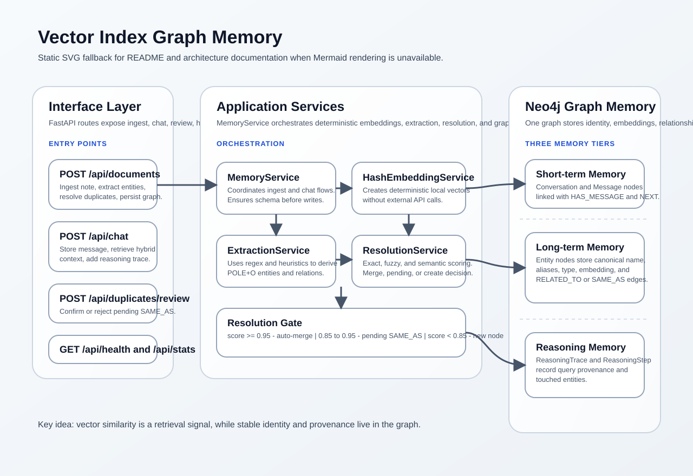
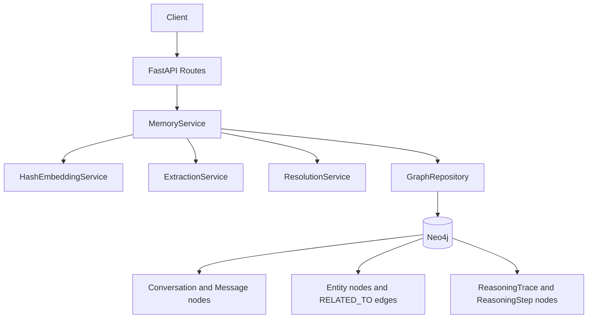
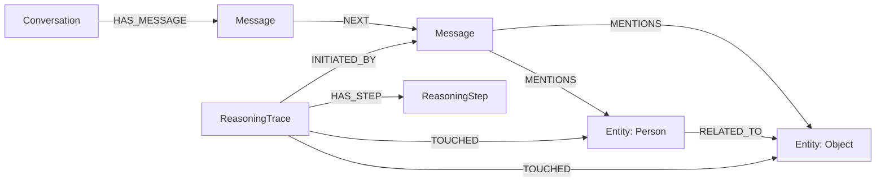

# Architecture

This document is the focused architecture companion to [../README.md](../README.md). It mirrors the same core design decisions so the README can stay broader and more narrative while this file stays concise and architecture-first.

> [!IMPORTANT]
> When the architecture changes, update this file and the matching sections in [../README.md](../README.md#architecture-overview) together so the repository keeps one consistent explanation of the system.

## Table of Contents

This section is important because the architecture reference is meant to be scanned quickly by readers who already understand the project context and only need the implementation model.

1. [System Overview](#system-overview)
2. [Core Idea](#core-idea)
3. [Component Responsibilities](#component-responsibilities)
4. [Memory Tiers](#memory-tiers)
5. [Deduplication Gate](#deduplication-gate)
6. [Retrieval Shape](#retrieval-shape)
7. [Synchronization Notes](#synchronization-notes)

## System Overview

This section matters because the project architecture is easiest to understand as a pipeline: requests enter through FastAPI, orchestration happens in the service layer, and all durable memory lands in Neo4j where identity, embeddings, and provenance stay together.

The static SVG below is the fallback for clients where Mermaid does not render. The README uses the same image so both documents stay aligned visually.

The image above is the non-Mermaid reference view. Its purpose is to preserve the same system map across GitHub, plain Markdown viewers, and local editors with different rendering support.

The Mermaid diagram above mirrors the one in [../README.md](../README.md#architecture-overview). It exists here so architecture readers do not have to switch files just to see the main control flow.

## Core Idea

This section is important because every implementation choice in the repository follows the same principle: vector similarity is useful for retrieval, but identity should be managed explicitly and conservatively in the graph.

The project treats vector similarity as a signal, not as identity. Identity lives in the graph, which allows one entity node to own its canonical name, aliases, type, relationships, embedding, and provenance links instead of scattering those concerns across separate systems.

## Component Responsibilities

This section matters because the architecture is intentionally layered. The repository is easier to maintain when routes, orchestration, scoring, and persistence each have a clear boundary.

| # | Component | Responsibility | Why It Exists |
| --- | --- | --- | --- |
| 1 | `app/routes/api.py` | Defines HTTP endpoints and error translation. | Keeps transport concerns out of domain logic. |
| 2 | `MemoryService` | Coordinates ingest and chat flows. | Centralizes the application workflow instead of duplicating it across routes. |
| 3 | `HashEmbeddingService` | Produces deterministic vectors and cosine similarity. | Makes retrieval and tests reproducible without external APIs. |
| 4 | `ExtractionService` | Extracts POLE+O entities and relation candidates. | Turns raw text into graph-ready structure. |
| 5 | `ResolutionService` | Decides merge, pending, or create. | Protects identity from over-eager semantic merging. |
| 6 | `GraphRepository` | Owns schema, graph writes, retrieval, and review operations. | Keeps Cypher and storage logic in one place. |

The table above summarizes the component map. Its purpose is to show which layer owns which decision so architectural changes can be localized instead of spreading across the whole codebase.

## Memory Tiers

This section is important because the repository stores three distinct classes of memory instead of flattening every fact and message into one undifferentiated index.

| # | Tier | Main Nodes | Primary Purpose |
| --- | --- | --- | --- |
| 1 | Short-term memory | `Conversation`, `Message` | Preserve session flow and recent interaction history. |
| 2 | Long-term memory | `Entity` | Preserve stable identity, aliases, descriptions, embeddings, and relationships. |
| 3 | Reasoning memory | `ReasoningTrace`, `ReasoningStep` | Preserve provenance about how context was assembled. |

The table above explains the memory partitioning. Its purpose is to show that the graph separates conversational recency, durable entity knowledge, and retrieval provenance instead of treating them as the same kind of record.

The diagram above gives the graph shape in a compact form. It mirrors the README memory-tier diagram so the entity, message, and reasoning relationships stay documented the same way in both places.

## Deduplication Gate

This section matters because the deduplication gate is the main protection against identity drift. The system does not use semantic closeness alone to collapse entities.

The service compares same-type entities using exact string matching, fuzzy matching with `SequenceMatcher`, and cosine similarity over deterministic embeddings. The strongest resulting score is then mapped into one of three actions.

$$
score = \max\left(exact,\ 0.45 \cdot fuzzy + 0.55 \cdot semantic\right)
$$

| # | Score band | Outcome | Why It Was Chosen |
| --- | --- | --- | --- |
| 1 | `score >= 0.95` | Merge | Only very strong matches should collapse into one canonical node. |
| 2 | `0.85 <= score < 0.95` | Pending `SAME_AS` | Ambiguous matches should remain reviewable. |
| 3 | `score < 0.85` | Create new entity | Weak evidence should not rewrite identity. |

The table above defines the decision policy. Its purpose is to document the architectural safety margin between obvious duplicates and uncertain candidates.

## Retrieval Shape

This section is important because the repository is not graph-only and not vector-only. Retrieval is deliberately hybrid so it can enter by similarity and then expand by structure.

The retrieval query combines:

1. semantic message matches within the active session
2. semantic entity matches from long-term memory
3. graph neighbors reached through typed relationships
4. provenance edges back to originating messages and reasoning traces

| # | Retrieval element | Value it adds |
| --- | --- | --- |
| 1 | Session-scoped message similarity | Keeps recent context tied to the active conversation. |
| 2 | Entity similarity | Recalls durable knowledge beyond the latest messages. |
| 3 | Relationship traversal | Adds structural context around the returned hits. |
| 4 | Reasoning provenance | Makes retrieval more inspectable and auditable. |

The table above explains the retrieval assembly. Its purpose is to show why the response payload is multi-part instead of a single list of chunks.

## Synchronization Notes

This section matters because documentation drift is easy to create in architecture-heavy repositories. The README and this document now point to the same visual asset and the same major concepts.

To keep both documents aligned, update these pairs together:

| # | README section | Architecture section |
| --- | --- | --- |
| 1 | `Architecture Overview` | `System Overview` |
| 2 | `Memory Tiers` | `Memory Tiers` |
| 3 | `Identity Resolution Strategy` | `Deduplication Gate` |
| 4 | `Retrieval Strategy` | `Retrieval Shape` |

The table above acts as a maintenance map. Its purpose is to show exactly which sections should move together when the design changes, so the README and architecture reference remain synchronized.
